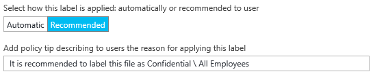

# Étape 2 : Configurer et publier la stratégie Azure Information Protection

>*S’applique à : Azure Information Protection*

Bien qu’Azure Information Protection soit fourni avec une stratégie par défaut que vous pouvez utiliser sans configuration, nous allons examiner cette stratégie et y apporter des modifications.

1. Dans une nouvelle fenêtre de navigateur, connectez-vous au [portail Azure](https://portal.azure.com) en tant qu’administrateur général ou administrateur de la sécurité pour votre locataire.

2. Dans le menu Hub, cliquez sur **Nouveau**, puis, dans la liste **MARKETPLACE**, sélectionnez **Sécurité + Identité**. Dans le panneau **Sécurité + Identité**, dans la liste **Applications proposées**, sélectionnez **Azure Information Protection**. Dans le panneau **Azure Information Protection**, cliquez sur **Créer**.

    Ceci active le service pour votre locataire et crée le panneau **Azure Information Protection**. Vous pouvez ainsi sélectionner le service dans la liste **Autres services** du hub lors de votre prochaine connexion au portail. 

    > [!TIP] 
    > Sélectionnez **Épingler au tableau de bord** pour créer une vignette **Azure Information Protection** sur votre tableau de bord. Vous n’avez ainsi pas besoin d’accéder au service lors de votre prochaine connexion au portail.

3. Notez les informations sur la page **Démarrage rapide** qui s’ouvre automatiquement la première fois que vous vous connectez au service. Vous pouvez y revenir plus tard. Pour ce didacticiel, cliquez sur **Stratégie globale** pour ouvrir le panneau **Stratégie : Globale**. Ce panneau s’ouvre automatiquement lors des connexions ultérieures et affiche la stratégie Information Protection par défaut automatiquement créée pour votre client :
    
    - Étiquettes de classification : **Personnel**, **Public**, **Interne**, **Confidentiel** et **Hautement confidentiel**. Les deux dernières étiquettes se développent pour afficher des sous-étiquettes incluant **Tous les employés** et **Tout le monde (sans protection)**, qui sont des exemples de sous-catégories dans une classification.
    
       > [!NOTE]
       > Votre stratégie par défaut peut différer légèrement de celle de ce didacticiel. Par exemple, vous avez une étiquette nommée **Interne** au lieu de **Général**, et **Secret** au lieu de **Hautement confidentiel**. Vous pouvez aussi avoir une sous-étiquette supplémentaire nommée **Destinataires uniquement**. La raison en est qu’il existe différentes versions de la stratégie par défaut, selon le moment où elle a été créée pour votre locataire. Vous pouvez aussi avoir l’avoir modifiée vous-même avant de commencer ce didacticiel.
       > 
       > Si votre stratégie par défaut est différente, vous pouvez néanmoins utiliser ce didacticiel, mais n’oubliez pas ces différences quand vous utilisez les instructions et les images qui suivent. Si vous voulez modifier votre stratégie par défaut pour qu’elle corresponde à la stratégie par défaut actuelle, consultez [La stratégie Azure Information Protection par défaut](../deploy-use/configure-policy-default.md).

    - Avec la configuration par défaut, des marquages visuels ne sont pas configurés pour certaines étiquettes (comme un pied de page, un en-tête, un filigrane). En fonction de votre stratégie par défaut, la protection peut ou non être définie pour certaines étiquettes. Par exemple :
    
    
    
    Par ailleurs, certains paramètres de stratégie ne sont pas définis. Tous les documents ou e-mails ne doivent pas nécessairement avoir une étiquette, il n’y a pas d’étiquette par défaut et les utilisateurs n’ont pas à fournir de justification quand ils changent les étiquettes :
    
    

## Modification des paramètres pour une étiquette par défaut et demande de justification

Pour notre didacticiel, nous allons modifier deux de ces paramètres de stratégie pour vous permettre de voir comment ils fonctionnent :

1. Pour **Sélectionner l’étiquette par défaut**, affectez la valeur **Général**. 

    Si vous n’avez pas cette étiquette car vous avez une version plus ancienne de la stratégie, choisissez **Interne** comme étiquette équivalente.

2. Pour **Les utilisateurs doivent fournir une justification pour définir une étiquette de classification moins élevée, supprimer une étiquette ou supprimer la protection**, affectez la valeur **Activé**.

## Configuration d’une étiquette pour la protection, d’un filigrane et d’une condition pour une demande de classification

Nous allons maintenant changer les paramètres d’une des sous-étiquettes, **Tous les employés**, de l’étiquette principale **Confidentiel**. 

Si votre étiquette **Confidentiel** n’a pas de sous-étiquettes car vous avez une version plus ancienne de la stratégie, vous pouvez utiliser l’étiquette **Confidentiel** à la place. Les étapes de configuration sont identiques, mais le nom du panneau de l’étiquette est **Confidentiel** au lieu de **Tous les employés**.

1. Vérifiez que l’étiquette **Confidentiel** est développée de façon à afficher les sous-étiquettes puis, pour l’étiquette **Tous les employés**, regardez si **Azure RMS** est affiché pour la colonne **PROTECTION**. Si c’est le cas, vous disposez de la dernière stratégie par défaut et la protection pour cette étiquette est configurée automatiquement pour vous. Si cette colonne est vide, vous devez configurer la protection dans une étape ultérieure.

    Sélectionnez cette sous-étiquette **Tous les employés** : dans le nouveau panneau **Étiquette : Tous les employés**, vous voyez maintenant les paramètres disponibles pour chaque étiquette. 

2. Lisez le texte de la **Description** pour cette étiquette. Il explique comment l’étiquette sélectionnée est destinée à être utilisée. Affiché dans une info-bulle, il aide les utilisateurs à décider quelle étiquette sélectionner.

3. Si la protection est déjà configurée pour votre étiquette, passez à l’étape 5.
    
    Si la protection n’est pas configurée pour votre étiquette, recherchez la section **Définir les autorisations pour les documents et les e-mails contenant cette étiquette**. Sélectionnez **Protéger**, puis la barre **Protection** :
    
     
    
4. Dans le panneau **Protection**, vérifiez que **Azure RMS** est sélectionné et choisissez **Sélectionner un modèle prédéfini**. Cliquez sur la zone de liste déroulante et choisissez le modèle par défaut qui permet à tous les utilisateurs de votre organisation d’afficher et de modifier le contenu protégé. 
    
    Si vous avez récemment obtenu votre abonnement, ce modèle se nomme **Confidentiel \ Tous les employés**. 
    
    Si vous avez votre abonnement depuis un certain temps, il est possible que votre modèle par défaut se nomme **\<nom de votre organisation> - Confidentiel**. Par exemple, si le nom de votre organisation est VanArsdel, Ltd, vous voyez et sélectionnez **VanArsdel, Ltd - Confidentiel** : 
    
    
    
    Si vous avez désactivé ce modèle Azure Rights Management par défaut, sélectionnez un autre modèle. Toutefois, si vous sélectionnez un modèle de service, vérifiez que votre compte est compris dans l’étendue.
    
4. Cliquez sur **OK** pour enregistrer vos modifications, ce qui ferme le panneau **Protection**. Vous voyez la barre Protection mise à jour dans le panneau **Étiquette : Tous les employés**. Exemple :
    
    
    
5. Maintenant, dans le panneau **Étiquette : Tous les employés**, recherchez la section **Définir un marquage visuel** :
    
    Pour le paramètre **Les documents avec cette étiquette ont un filigrane**, cliquez sur **Activé** puis, dans la zone **Texte**, tapez le nom de votre organisation. Dans notre exemple, **VanArsdel, Ltd** : 
    
    
    
    Bien que vous puissiez changer la taille, la couleur et la disposition des filigranes, nous laissons pour le moment ces paramètres à leurs valeurs par défaut.
    
6. Recherchez la section **Configurer des conditions pour appliquer automatiquement cette étiquette** :
    
    Cliquez sur **Ajouter une nouvelle condition**, puis dans le panneau **Condition**, sélectionnez les éléments suivants :
    
    a. **Choisir le type de condition** : conservez la valeur par défaut **Prédéfinie**.
    
    b. **Sélectionner Prédéfinie** : Dans la liste déroulante, sélectionnez **Numéro de carte de crédit**.
    
    c. **Nombre minimal d’occurrences** : conservez la valeur par défaut **1**.
    
    d. **Comptabiliser seulement les occurrences avec des valeurs uniques** : conservez la valeur par défaut **Désactivé**.
    
    
    
    Cliquez sur **Enregistrer** pour revenir au panneau **Étiquette : Tous les employés**.

7. Dans le panneau **Étiquette : Tous les employés**, vous voyez que **Numéro de carte de crédit** est affiché comme **NOM DE LA CONDITION**, avec **1** **OCCURRENCES** :
    
    

8. Pour **Sélectionner comment cette étiquette est appliquée** : conservez la valeur par défaut **Recommandée** et ne modifiez pas le conseil de stratégie par défaut :
    
    

9. Dans la zone **Saisir des notes pour les tâches de nettoyage internes**, tapez **À des fins de test uniquement** :
    
    

10. Cliquez sur **Enregistrer** sur ce panneau **Étiquette : Tous les employés**. Puis, dans le panneau **Stratégie : Globale**, cliquez une nouvelle fois sur **Enregistrer**.
    
    Si vous avez configuré l’étiquette pour la protection, celle-ci est maintenant mise à jour pour afficher la protection Azure RMS :

    
    
    Vous voyez aussi que les paramètres sont configurés avec les modifications que vous avez apportées à l’étiquette par défaut et à la justification :
    
    
    
11. Maintenant que nous avons apporté des modifications et les avons enregistrées, nous voulons les mettre à la disposition des utilisateurs. Pour cela, dans le panneau **Azure Information Protection** initial, cliquez sur **Publier**, puis sur **Oui** pour confirmer.

    

Vous pouvez fermer le portail Azure, ou le laisser ouvert pour essayer des options de configuration supplémentaires après avoir terminé ce didacticiel.

Maintenant que vous avez examiné la stratégie par défaut et apporté des modifications, l’étape suivante consiste à installer le client Azure Information Protection.

|Pour en savoir plus|Informations supplémentaires|
|--------------------------------|--------------------------|
|À propos des options de configuration de la stratégie|[Configuration de la stratégie Azure Information Protection](../deploy-use/configure-policy.md)|
|Paramètres de configuration de la stratégie par défaut|[La stratégie Azure Information Protection par défaut](../deploy-use/configure-policy-default.md)|

>[!div class="step-by-step"]
[&#171; Étape 1](infoprotect-tutorial-step1.md)
[Étape 3 &#187;](infoprotect-tutorial-step3.md)

[!INCLUDE[Commenting house rules](../includes/houserules.md)]