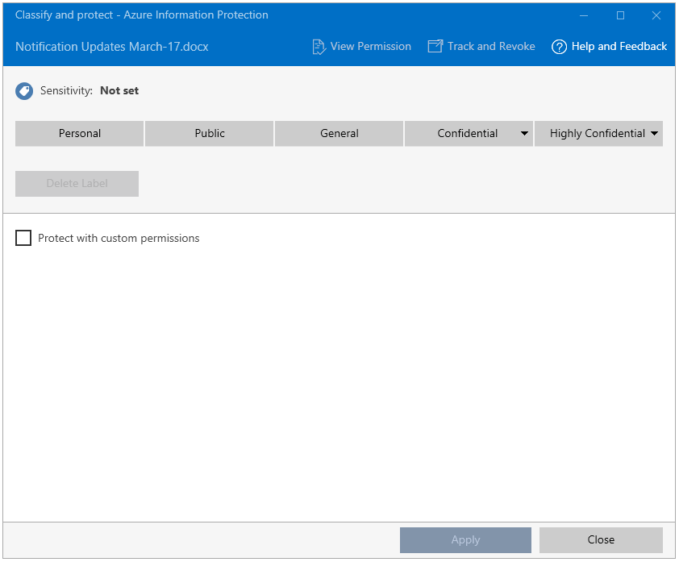

# Étape 5 : Voir le partage de fichiers protégés en action et effectuer le suivi de votre document 

>*S’applique à : Azure Information Protection*

Pour cette étape finale du didacticiel, recherchez un document Word ou une feuille de calcul que vous avez déjà créés et que vous allez envoyer à un partenaire ou à un collègue. Dans le cadre de ce didacticiel, faites en sorte que le document contienne du texte, quel qu’il soit, afin de pouvoir confirmer plus facilement que le destinataire autorisé a pu le lire.

Ensuite, vous pouvez partager en toute sécurité ce document par courrier électronique. 

## Partage en toute sécurité d’un document par courrier électronique

1. Dans l’Explorateur de fichiers, cliquez avec le bouton droit sur votre document et sélectionnez **Classifier et protéger**. La boîte de dialogue **Classifier et protéger - Azure Information Protection** s’ouvre :

    

2. Sélectionnez l’option **Protéger avec des autorisations personnalisées** qui affiche des options supplémentaires.

3. Pour **Sélectionner des autorisations**, conservez la valeur par défaut **Visionneuse – Affichage uniquement**.

    Avec ces paramètres, les destinataires seront en mesure d’afficher le document, mais pas de le modifier ou de l’imprimer.

4. Dans la zone **Sélectionnez les utilisateurs**, tapez une ou plusieurs adresses e-mail professionnelles, comme lorsque vous envoyez un document à une personne avec laquelle votre organisation entretient des relations commerciales. Veillez à indiquer une adresse e-mail professionnelle, comme **janetm@contoso.com** ou **p.dover@fabrikam.com**, car Azure Information Protection ne prend pas en charge les adresses e-mail personnelles. 

    Sinon, cliquez sur le carnet d’adresses pour sélectionner l’adresse e-mail d’un collègue :

      
    
    Après avoir spécifié les adresses, copiez-les dans le Presse-papiers, car nous les utiliserons dans une étape ultérieure.

5. Cliquez sur **Appliquer** et attendez le message **Tâche terminée** pour voir les résultats. Cliquez ensuite sur **Fermer**.

4. Dans l’Explorateur de fichiers, cliquez avec le bouton droit sur votre fichier et, cette fois, sélectionnez **Envoyer à** > **Destinataire de l’e-mail**. Cette action joint votre document à un e-mail avec du texte par défaut que nous allons modifier.

5. Avant de modifier le texte par défaut, collez les adresses e-mail que vous avez spécifiées précédemment dans le champ **À**. 

6. Si vous le souhaitez, saisissez l’objet de votre choix dans le champ **Objet**, par exemple : **Je partage un document protégé**. 

7. Modifiez la description du message par défaut afin qu’elle soit adaptée à vos destinataires. Toutefois, ajoutez le texte suivant :

    **J’ai protégé ce fichier avec Microsoft Azure Information Protection. Pour une première utilisation, consultez ces instructions : https://aka.ms/rms-signup.** 

    

    Cliquez sur **Envoyer**.

Maintenant que vous avez envoyé votre document protégé, vous pouvez demander à vos destinataires de l’ouvrir dès qu’ils le reçoivent. 

## demande au destinataires d’ouvrir le document envoyé par courrier électronique

Vos destinataires peuvent utiliser de nombreux appareils pour lire le document protégé que vous avez envoyé en pièce jointe d’un courrier électronique. Les appareils incluent les iPad, les iPhone, les tablettes et les téléphones Android, les ordinateurs Mac, ainsi que les ordinateurs Windows.

Demandez-leur de lire le message électronique que vous leur avez envoyé. En supposant que c’est la première fois qu’ils ont reçu des pièces jointes protégées par Rights Management, demandez-leur de cliquer sur le lien des instructions. Les utilisateurs voient alors la page de **bienvenue** de Microsoft Azure Information Protection, qui les invite à entrer leur adresse e-mail professionnelle.

Lorsqu’ils cliquent sur **S’inscrire**, Azure Information Protection vérifie si leur organisation possède un abonnement qui inclut le service de protection de données Azure Rights Management. Si ce n’est pas le cas, ils peuvent demander un compte gratuit.

### Instructions pour le destinataire : affichage de la pièce jointe du document protégé

1. Sur un PC ou un appareil mobile avec Office installé, ouvrez la pièce jointe pour lire le document.  

2.  Si vous êtes invité à saisir votre nom d’utilisateur et votre mot de passe, indiquez votre nom d’utilisateur dans le même format que l’adresse de messagerie utilisée pour vous envoyer le courrier électronique et la pièce jointe. Par exemple, **janetm@contoso.com** ou **p.dover@fabrikam.com**. En ce qui concerne votre mot de passe, saisissez celui que vous avez fourni lors de votre inscription à RMS for individuals. Ou, si votre organisation dispose d’un service cloud tel qu’Office 365 ou qu’elle utilise Azure, entrez votre mot de passe de travail habituel.

3. Lisez le contenu du document quand il s’ouvre. Étant donné que le document est en lecture seule, vous ne pouvez pas modifier son contenu.

Votre destinataire peut éventuellement transférer l’e-mail à d’autres personnes que vous n’avez pas spécifiées dans votre e-mail d’origine. Ces personnes ne pourront pas ouvrir la pièce jointe. Lorsqu’elles sont invitées à saisir leur nom d’utilisateur, l’accès au document leur est refusé.

Maintenant que le destinataire a ouvert la pièce jointe et l’a éventuellement transférée à un autre utilisateur, vous êtes prêt à suivre votre document.

## Suivi du document protégé

1.  Ouvrez le document que vous avez protégé et partagé. La bannière d’informations confirme les paramètres de protection personnalisés que vous avez spécifiés :

    

2.  Sur l’onglet **Accueil** , cliquez sur **Protéger** > **Suivre et révoquer** :

    

    Vous accédez ainsi au site de suivi de document.

2.  Si la page **Protégez et partagez comme vous le souhaitez** apparaît, cliquez sur **Se connecter** et indiquez à nouveau votre nom d’utilisateur et votre mot de passe.

3.  Dans la page **Vos documents partagés** apparaît le nom du document que vous avez partagé. À ce stade, il s’agit du seul fichier affiché, mais la liste s’allongera à mesure que vous partagerez des fichiers.

    Sur cette page, vous pouvez voir le moment où vous avez partagé le document (moment de l’envoi du courrier électronique contenant la pièce jointe protégée), la date de la dernière activité et le nom du destinataire auquel vous avez envoyé le courrier. Cliquez sur le nom du document pour plus de détails.

4.  Sur la nouvelle page qui porte le nom du fichier sur lequel vous avez cliqué, vous pouvez voir les détails du résumé de ce document, ainsi qu’une liste d’autres options disponibles pour le document (**Liste**, **Chronologie**, **Carte**, **Paramètres**).

    Cliquez sur chaque option pour explorer les différentes façons de suivre votre document protégé. Sinon, sur la page **Résumé** , cliquez sur **Ouvrir dans Excel** pour exporter les informations dans une feuille de calcul, ou cliquez sur **Révoquer l’accès** pour cesser de partager le document.

Vous pouvez revenir sur ce site pour suivre les autres activités de votre document protégé ou révoquer son accès si nécessaire. Vous pouvez même accéder au site à partir de votre appareil mobile ou de votre tablette, à l’aide d’un navigateur et du lien suivant : [suivi de document](http://go.microsoft.com/fwlink/?LinkId=529562)

|Pour en savoir plus|Informations supplémentaires|
|--------------------------------|--------------------------|
|Instructions complètes pour la protection des fichiers que vous pouvez partager en toute sécurité|[Classifier et protéger un fichier ou un e-mail](../rms-client/client-classify-protect.md)|
|À propos du compte gratuit pour l’inscription d’autres utilisateurs|[RMS for individuals et Azure Rights Management](../understand-explore/rms-for-individuals.md)|
|À propos de l’utilisation du site de suivi de document|[Suivre et révoquer vos documents](../rms-client/client-track-revoke.md)

## Étapes suivantes

Maintenant que vous avez vu comment personnaliser la stratégie Azure Information Protection par défaut et comment fonctionne l’étiquetage d’un document Word, essayez d’appliquer certains autres paramètres pour voir comment ils fonctionnent dans les autres applications Office qui prennent en charge Azure Information Protection : Excel, PowerPoint et Outlook. Si ces applications étaient ouvertes quand vous avez installé le client Azure Information Protection, fermez et rouvrez-les avant d’essayer de les utiliser avec Azure Information Protection.

Essayez de partager davantage de documents, suivez leur utilisation et vérifiez le fonctionnement de la révocation des documents.

Vous pouvez ensuite juger utile de consulter certains [forums aux questions](faqs.md) sur Azure Information Protection et de lire d’autres articles de la documentation. Mais si vous êtes prêt à déployer Azure Information Protection pour votre organisation, vous pouvez passer directement à la [Feuille de route pour le déploiement d’Azure Information Protection](../plan-design/deployment-roadmap.md). 

[!INCLUDE[Commenting house rules](../includes/houserules.md)]