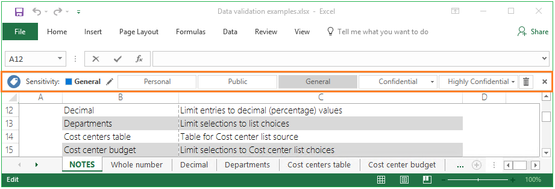

# Qu’est-ce qu’Azure Information Protection ?

>*S’applique à : [Azure Information Protection](https://azure.microsoft.com/pricing/details/information-protection)*

Azure Information Protection (parfois appelée AIP) est une solution basée sur le cloud qui permet à une organisation de classifier, d’étiqueter et de protéger ses documents et les e-mails. Ces opérations peuvent être effectuées automatiquement par les administrateurs qui définissent des règles et des conditions ou manuellement par les utilisateurs, qui peuvent éventuellement se voir proposer des recommandations. 

L’image suivante illustre Azure Information Protection en action. L’administrateur a configuré des règles pour détecter les données sensibles (dans ce cas, des informations de carte de crédit). Quand un utilisateur enregistre un document Word qui contient des informations de carte de crédit, il voit une info-bulle personnalisée qui lui recommande d’appliquer une étiquette spécifique que l’administrateur a configurée. Cette étiquette classe et, selon la configuration, peut également protéger le document. 

Une fois que votre contenu est classifié (et éventuellement protégé), vous pouvez suivre et contrôler son utilisation. Vous pouvez analyser les flux de données pour obtenir des informations sur vos activités, détecter les comportements à risque et prendre des mesures correctives, suivre l’accès aux documents, empêcher la fuite de données ou une mauvaise utilisation des données, etc.

## Comment les étiquettes appliquent la classification

Les étiquettes Azure Information Protection vous permettent d’appliquer une classification aux documents et e-mails. Ainsi, la classification est identifiable à tout moment, quel que soit l’endroit où les données sont stockées ou avec qui elles sont partagées. Les étiquettes intègrent les marquages visuels comme les en-têtes, pieds de page ou filigranes. Les métadonnées sont ajoutées aux fichiers et aux en-têtes d’e-mail en texte clair. Le texte clair fait en sorte que les autres services, comme les solutions de prévention de perte de données, puissent identifier la classification et prendre les mesures appropriées. 

Par exemple, l’e-mail suivant a été classé sous l’étiquette « Général ». Cette étiquette est ajoutée sous forme de pied de page à l’e-mail. Ce pied de page est un indicateur visuel pour tous les destinataires auxquels il est destiné spécifiant qu’il s’agit de données métier d’ordre général qui ne doivent pas être envoyées à l’extérieur de l’organisation. Cette étiquette est également incorporée aux en-têtes d’e-mail afin que les services d’e-mail puissent inspecter cette valeur et éventuellement créer une entrée d’audit ou empêcher son envoi à l’extérieur de l’organisation.

## Comment les données sont protégées

La technologie de protection utilise *Azure Rights Management* (ou Azure RMS, dans sa forme abrégée courante). Cette technologie est intégrée à d’autres services cloud et applications Microsoft, tels qu’Office 365 et Azure Active Directory. Vous pouvez aussi l’utiliser avec vos propres applications métier et avec les solutions de protection des informations d’autres éditeurs de logiciels, que ces applications et solutions soient locales ou dans le cloud.

Cette technologie de protection utilise des stratégies de chiffrement, d’identité et d’autorisation. À l’image des étiquettes appliquées, la protection avec Rights Management reste associée aux documents et aux e-mails, indépendamment de leur emplacement (à l’intérieur ou en dehors de votre organisation, de vos réseaux, de vos serveurs de fichiers et de vos applications). Cette solution de protection des informations vous permet de garder le contrôle de vos données, même quand vous les partagez avec d'autres personnes.

Par exemple, vous pouvez configurer un document (rapport, feuille de calcul de prévision de ventes, etc.) pour qu’il soit accessible uniquement par les personnes de votre organisation et déterminer s’il peut être modifié, s’il est disponible en lecture seule uniquement ou empêcher son impression. Vous pouvez configurer les e-mails de la même façon et également empêcher leur transfert ou l'utilisation de l'option Répondre à tous. 

Ces paramètres de protection peuvent être inclus dans votre configuration d’étiquette pour permettre aux utilisateurs de classifier et protéger leurs documents et e-mails simplement en appliquant une étiquette. Toutefois, les mêmes paramètres de protection peuvent aussi être utilisés par les applications et services qui prennent en charge la protection, mais pas l’étiquetage. Pour ces applications et services, les paramètres de protection deviennent disponibles en tant que *modèles Rights Management*.

### Modèles Rights Management

Dès que vous activez le service Azure Rights Management, deux modèles par défaut sont disponibles, qui vous permettent de limiter l’accès aux données aux utilisateurs appartenant à votre organisation. Vous pouvez utiliser ces modèles pour empêcher immédiatement une fuite des données hors de votre organisation. Vous pouvez également compléter ces modèles par défaut en configurant vos propres paramètres de protection qui appliquent des contrôles plus restrictifs.

Quand vous créez une étiquette pour Azure Information Protection qui inclut des paramètres de protection, cette action crée en fait un modèle Rights Management correspondant. Vous pouvez ensuite utiliser aussi ce modèle avec les applications et services qui prennent en charge Azure Rights Management.

Par exemple, à partir du centre d’administration Exchange, configurez les règles de flux de courrier Exchange Online pour utiliser ces modèles :

Pour plus d’informations sur la protection Azure Rights Management, consultez [Qu’est-ce qu’Azure Rights Management ?](what-is-azure-rms.md)

## Intégration avec les flux de travail de l’utilisateur final pour les documents et les e-mails

Azure Information Protection s’intègre aux workflows existants des utilisateurs finaux quand le client Azure Information Protection est installé. Ce client installe la barre Information Protection dans les applications Office, comme illustré dans la première image qui montre cette barre dans Word. La même barre Information Protection est ajoutée à Excel, PowerPoint et Outlook. Par exemple :

Cette barre Information Protection permet aux utilisateurs finaux de sélectionner des étiquettes pour une classification correcte. Si nécessaire, les étiquettes peuvent également être appliquées automatiquement pour faciliter le travail des utilisateurs ou pour respecter les stratégies de votre organisation.

Pour classer et protéger d’autres types de fichiers, et pour prendre en charge plusieurs fichiers à la fois, les utilisateurs peuvent cliquer avec le bouton droit sur les fichiers ou sur un dossier à partir de l’Explorateur de fichiers Windows :

Lorsque les utilisateurs sélectionnent l’option **Classifier et protéger**dans l’Explorateur de fichiers, ils peuvent ensuite sélectionner une étiquette de la même façon qu’ils utilisent la barre Information Protection dans leurs applications de bureau Office. Ils peuvent également définir leurs propres autorisations personnalisées, si nécessaire.

Les utilisateurs avancés (et administrateurs) peuvent trouver l’utilisation des commandes PowerShell plus efficace pour la gestion et la configuration de la classification et de la protection de plusieurs fichiers. Les commandes PowerShell pour effectuer ces actions sont automatiquement incluses dans le client, même si vous pouvez également installer le module PowerShell séparément.

Après qu’un document a été protégé, les utilisateurs et administrateurs peuvent utiliser un site de suivi des documents pour surveiller qui accède à ces documents et à quel moment. En outre, s’ils suspectent une utilisation incorrecte, ils peuvent révoquer l’accès à ces documents :

### Intégration supplémentaire pour les e-mails

Quand vous utilisez Azure Information Protection avec Exchange Online, vous profitez d’un autre avantage : la possibilité d’envoyer des e-mails protégés à n’importe quel utilisateur, avec l’assurance qu’ils peuvent le lire sur n’importe quel appareil.

Par exemple, des utilisateurs doivent envoyer des informations sensibles à des comptes e-mails personnels en utilisant **Gmail**, **Hotmail** ou un compte **Microsoft**. Ou à des utilisateurs qui n’ont pas de compte pour Office 365 ou dans Azure AD. Ces e-mails doivent être chiffrés au repos et pendant le transit, et être lus seulement par les destinataires d’origine.

Ce scénario nécessite les [nouvelles fonctionnalités de chiffrement de messages d’Office 365](https://techcommunity.microsoft.com/t5/Security-Privacy-and-Compliance/Email-Encryption-and-Rights-Protection/ba-p/110801). Si les destinataires ne peuvent pas ouvrir l’e-mail protégé dans leur client de messagerie natif, ils peuvent utiliser un code secret à usage unique pour lire les informations sensibles dans un navigateur.

Par exemple, un utilisateur Gmail voit ceci dans un e-mail :

Pour les utilisateurs qui envoient l’e-mail, leur flux de travail ne diffère pas de l’envoi d’un e-mail protégé à un utilisateur de leur propre organisation. Par exemple, ils peuvent sélectionner le bouton **Ne pas transférer** que le client Azure Information Protection peut ajouter au ruban Outlook. Cette fonctionnalité Ne pas transférer peut aussi être intégrée dans une étiquette que les utilisateurs sélectionnent, pour que l’e-mail soit classé et protégé :

Vous pouvez aussi fournir automatiquement une protection aux utilisateurs avec des règles de flux de messagerie qui appliquent une protection des droits. 

Quand vous joignez des documents Office à ces e-mails, ces documents sont eux aussi automatiquement protégés.

## Ressources pour Azure Information Protection

- Version d’évaluation gratuite : [Enterprise Mobility + Security E5](https://portal.office.com/Signup/Signup.aspx?OfferId=87dd2714-d452-48a0-a809-d2f58c4f68b7)

- Téléchargement du client : [Client Azure Information Protection](https://www.microsoft.com/en-us/download/details.aspx?id=53018)

- Téléchargement d’un guide d’utilisation personnalisable : [Guide d’adoption Azure Information Protection pour l’utilisateur final](https://download.microsoft.com/download/7/1/2/712A280C-1C66-4EF9-8DC3-88EE43BEA3D4/Azure_Information_Protection_End_User_Adoption_Guide_EN_US.pdf)

- FAQ : [Forum aux questions sur Azure Information Protection](../get-started/faqs.md)

- Yammer : [Azure Information Protection](https://www.yammer.com/AskIPTeam)

De plus, **Microsoft Ignite 2017** propose de nombreuses sessions pour Azure Information Protection qui sont disponibles sur demande. Pour avoir un aperçu des annonces qui ont été faites pendant cette conférence, consultez [Nouveautés d’Azure Information Protection @ Ignite 2017](https://cloudblogs.microsoft.com/ENTERPRISEMOBILITY/2017/09/27/whats-new-in-azure-information-protection-ignite-2017/). 

Vous pouvez [rechercher](https://myignite.microsoft.com/videos?q=%2522azure%2520information%2520protection%2522) les sessions qui sont marquées pour Azure Information Protection sur le site Web Ignite. Toutefois, nous vous recommandons de commencer avec les sessions suivantes :

- [Protecting complete data lifecycle using Microsoft information protection capabilities](https://myignite.microsoft.com/videos/55397) (Protection de l’ensemble du cycle de vie des données avec les fonctionnalités de protection des informations de Microsoft)

- [Accelerate Azure information protection deployment and adoption](https://myignite.microsoft.com/videos/53454) (Accélérer le déploiement et l’adoption de la protection des informations Azure)

- [Discover what’s new in Azure Information Protection and learn about the roadmap and strategy](https://myignite.microsoft.com/videos/53453) (Découvrir les nouveautés d’Azure Information Protection, la feuille de route et la stratégie)

- [Stratégies de gestion des clés de chiffrement à des fins de conformité](https://myignite.microsoft.com/videos/53455)

- [Protect and control your sensitive emails with new Office 365 Message Encryption capabilities](https://myignite.microsoft.com/videos/53230) (Protéger et contrôler vos e-mails confidentiels avec les nouvelles fonctionnalités de chiffrement de messages Office 365)

## Étapes suivantes

Lisez le billet de blog [Azure Information Protection: Ready, set, protect!](https://cloudblogs.microsoft.com/enterprisemobility/2017/02/21/azure-information-protection-ready-set-protect/).

Configurez et découvrez Azure Information Protection par vous-même avec notre [Didacticiel de démarrage rapide](../get-started/infoprotect-quick-start-tutorial.md) en 5 étapes. Ou, si vous êtes prêt à déployer ce service dans votre organisation, consultez la [feuille de route du déploiement d’Azure Information Protection](../plan-design/deployment-roadmap.md).

Vous connaissez peut-être Azure Information Protection sous un autre nom ? Consultez nos [autres termes pour le service](azure-rms-aka.md).

[!INCLUDE[Commenting house rules](../includes/houserules.md)]
